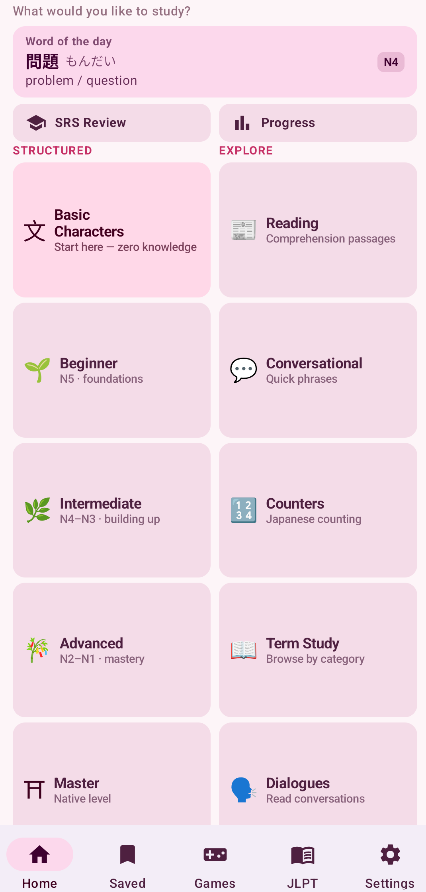
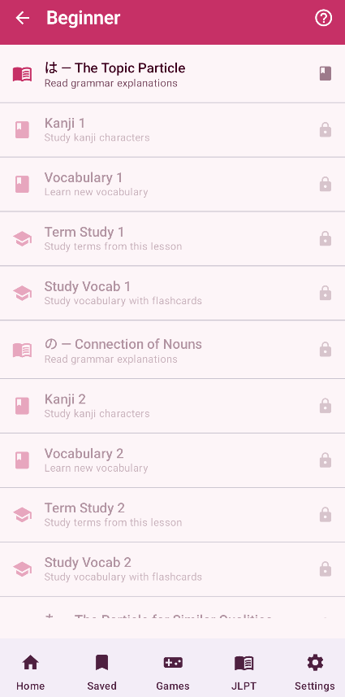
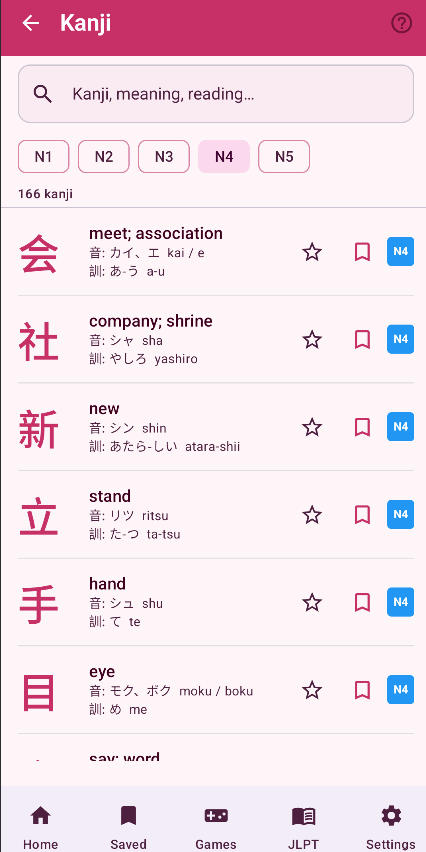
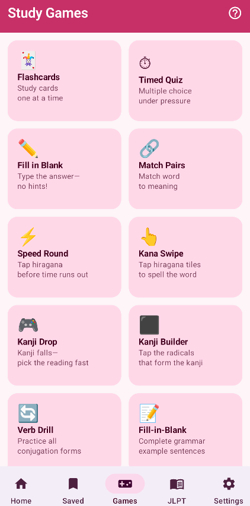
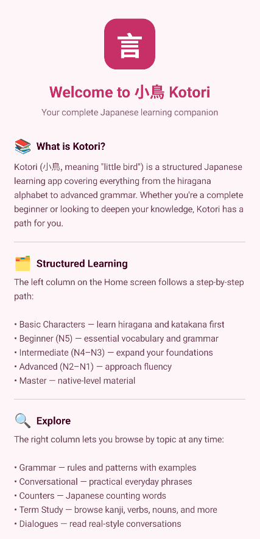

# Kotori - Japanese Learning App 🇯🇵

Kotori is a structured Japanese language learning application built for Android using Kotlin and Jetpack Compose. It combines JLPT-aligned curriculum progression with interactive study games, gamified reinforcement systems, and deep reference tooling for Hiragana, Katakana, Kanji, Vocabulary, and Grammar.

---

## ✨ Key Features

### 📚 Structured JLPT Learning Path
A guided learning system organized by JLPT levels:
- Beginner (N5)
- Intermediate (N4)
- Advanced (N3)
- Master (N2)

Each level follows a **4-step learning cycle**:
1. Grammar lesson
2. Vocabulary introduction
3. Term study (flashcards)
4. Vocabulary reinforcement (flashcards)

Progress is gated sequentially to ensure structured mastery and retention.

---

### 🧠 Kana Learning System (Hiragana & Katakana)

Interactive kana mastery system with multiple learning modes:

- 🔗 Match Pairs — match kana with romaji in grid-based batches
- 📇 Flashcards — flip cards with self-assessment
- ⌨️ Type Romaji — instant feedback typing practice
- 🎯 Multiple Choice — 2×2 selection grid
- ⏱ Kana Speed Mode — timed recognition with color-coded urgency

Includes grouped kana tables, study-all modes, and mastery-based progression tracking.

---

### 📖 Reference & Study System

Comprehensive reference modules for:
- Grammar
- Vocabulary
- Verbs
- Adjectives
- Nouns
- Kanji
- Radicals
- Phrases

Features:
- Searchable & filterable lists
- Detail screens with full explanations
- Cross-linked navigation between related concepts (e.g., kanji ↔ radicals)
- Bookmarking system for saved study items
---

### 🧩 Radical Learning System

Dedicated kanji radical learning module:
- Grouped by stroke count
- Radical detail breakdown (meaning, variants, stroke order context)
- Kanji decomposition exploration
- Radical-based study games
- “Study All” and targeted learning modes

---

### 🎮 Study Games Suite

Gamified reinforcement system with multiple interactive study games:

- Flashcards (classic spaced repetition style)
- Timed Quiz (speed-based recall)
- Match Pairs (association learning)
- Kana Speed Round (timed kana recognition)
- Kana Swipe (word construction from tiles)
- Kanji Drop (reaction-based reading selection)
- Kanji Builder (radical composition challenge)

All games support custom study sets and a unified setup flow.
---

### 💾 Saved Items System

Persistent study tracking powered by Room:
- Real-time reactive saved list
- Grouped by content type (vocab, kanji, grammar, etc.)
- One-tap study mode for saved vocabulary sets
- Direct navigation to any saved item’s detail view

---

### ⚙️ Settings & Personalization

Fully reactive app-wide configuration system:

- 🎨 Themes: System, Light, Dark, Sakura, Ocean, Forest
- 🔤 Romaji & Furigana toggles
- 🔁 Study direction (JP → EN / EN → JP)
- 📘 Learning mode (structured unlock system)
- ♿ Accessibility options (large text, high contrast)
- 🔊 Audio controls (placeholder for future expansion)

All settings are powered by StateFlow and instantly recompose the UI.
---

### 🎨 Dynamic Theming System

Custom Material theme system supporting multiple visual identities:
- Default (Japanese red / indigo / green palette)
- Sakura (soft pink aesthetic)
- Ocean (blue/teal theme)
- Forest (dark green + amber tones)

Theme changes propagate instantly across the entire app via reactive state management.

---

### 🧭 Onboarding & Help System

Context-aware onboarding system:
- First-time screen detection using persistent storage
- Automatic help dialog on first visit
- Persistent “?” help button for all major screens
- Lightweight, non-intrusive guidance system
---

## 🏗 Architecture Overview

- **Pattern:** MVVM + Repository Pattern
- **State Management:** StateFlow / LiveData hybrid (depending on module)
- **Persistence:**
  - Room (local database)
  - SharedPreferences (progress + onboarding)
- **UI:** Jetpack Compose (Material3)
- **Navigation:** Compose Navigation

Key design principles:
- Modular feature-based architecture
- Offline-first design
- Reactive UI driven by state streams

---

## 🧱 Tech Stack

- Kotlin
- Jetpack Compose
- Room Database
- DataStore / SharedPreferences
- Kotlin Coroutines & Flow
- Material 3
- Android Architecture Components

---
## Screenshots






---

## Getting Started

```bash
git clone https://github.com/I4MDLuffy/Kotori-Japanese-Learning-App.git
cd Kotori-Japanese-Learning-App
